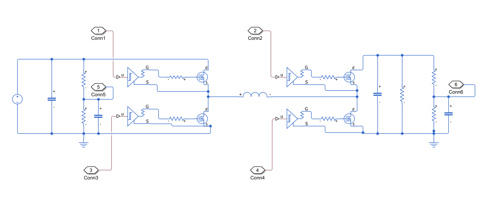

# breadboard-4sbb

Four-switch bidirectional buck-boost DC-DC converter for a 30 V input and 15–60 V output, built on a breadboard with IRFP260N MOSFETs and a hand-wound 557 µH air-core inductor.

This repository holds the design calculator, the measured inductor data, a Simulink power-stage model, and the handwritten design equations ([4sbb-equations.pdf](4sbb-equations.pdf)).



## Calculator

From this directory, run:

```powershell
python .\4sbb-calculator.py
```

The program lists constants with units, accepts comma-separated SI values (blank fields keep defaults), asks for load resistance if omitted, prints the calculations, and opens Matplotlib plots. The default load is `Vout²/Pout`. An explicit resistance takes precedence over `pout`.

The first eight constants are `vin, vout, pout, supply_current_limit, fs, inductance, cin, cout`. For example, enter `30,24,30,5,50000,220e-6,100e-6,100e-6` for a buck operating point, then Enter for the calculated load.

To run without prompts, save plots without opening windows, or override named constants:

```powershell
python .\4sbb-calculator.py --defaults --no-show
python .\4sbb-calculator.py --defaults --set vin=20 --set vout=30
python .\4sbb-calculator.py --defaults --set vout=24 --no-plot
```

`state-space.png` shows representative buck, boost, and transition responses to a 1% output-voltage disturbance. The oscillation there is the L–Cout resonance, not switching ripple. The blue trace includes series resistance Rs = `inductor_dcr` + 2·`rds_on_25`·`rds_hot_factor` (one conducting FET per leg) at the duties a voltage loop would settle at. The faint trace is the lossless model at ideal duties. `state-space-sweep.png` shows the ideal steady-state high-side duties and inductor current across `vin_min` to `vin_max`. Both are averaged open-loop CCM models, without a feedback controller.

`state-space-switching.png` shows two periods of the switched steady state for the same three cases. The calculator solves the periodic steady state exactly, using matrix exponentials of the piecewise-linear circuit, so no startup transient has to settle. Vin is stiff, dead time is neglected and Cout ESR is included. Synchronous switches allow negative inductor current, so there is no DCM. The printed `Switching simulation` section reports the simulated ripple at the operating point, both lossless at ideal duties (a check on the analytical ripple) and with losses at regulated duties. If the Rs·IL drop is larger than `transition_window`, Vin just outside the window cannot reach Vout in the selected mode, and the calculator warns. `--duration` sets the transient duration in seconds, and `--plot-path` changes the output filename.

MOSFET defaults are IRFP260NPBF datasheet values. The gate supply is one 15 V, 1 W MER1S0515SC per FET, so `gate_power_available` is a per-FET budget. Inductor defaults are the measured air-core coil: 557 µH, `inductor_dcr` 1.19 Ω (Rs at 20 Hz; confirm with a 4-wire DC measurement), and `inductor_ac_resistance` 18.8 Ω (Rs at 50 kHz, applied to the ripple current; update it if `fs` changes). Gate-driver, capacitor ESR, timing and heatsink defaults are still examples. Replace them with values at the actual operating conditions. For core loss, provide `core_k`, `core_alpha`, `core_beta`, `core_delta_b`, and `core_volume` together, with coefficient units consistent with Hz, tesla, and m³. Otherwise core loss is reported unavailable and efficiency is a partial estimate. Supply all three of `theta_jc`, `theta_cs`, and `theta_sa` to model a shared heatsink; otherwise the calculator uses `theta_ja` per device.

Dependencies: Python 3.10+, NumPy, Matplotlib. Run regression checks from this directory with `python -m unittest discover -p 'test_*.py' -v`.

Equation sources, corrected handwritten typos, research and validation workflow are recorded in [implementation-notes.md](implementation-notes.md).

## Measured air-core coil

`coil-measurements.csv` contains all 19 instrument readings from the photo album, including frequency, nominal AC level, Ls, Rs, terminal VAC/IAC and source photo IDs. Run:

```powershell
python .\plot-coil.py
python .\plot-coil.py --no-show
python .\plot-coil.py --reference-frequency 1000 --no-show
```

The script saves `coil-ls-rs-vs-frequency.png`, `coil-derived.csv` (reactance, impedance, Q and consistency checks), and `coil-analysis.md`. The default reference is 50 kHz: Ls = 558.6351 µH at 100 mV and 557.5985 µH at 1 V. Frequency-specific equivalent Ls is reported; no geometry-based inductance is claimed.

The coil is wound on a plastic former, so magnetic Isat is not applicable. A thermal current rating needs separate DC resistance and temperature measurements. If a measured DCR and justified DC loss allowance become available, use `--dcr-ohm VALUE --allowed-loss-w VALUE` to calculate a conditional DC heating budget. This excludes AC losses and is not a winding ampacity rating. See [coil-measurement-notes.md](coil-measurement-notes.md).
